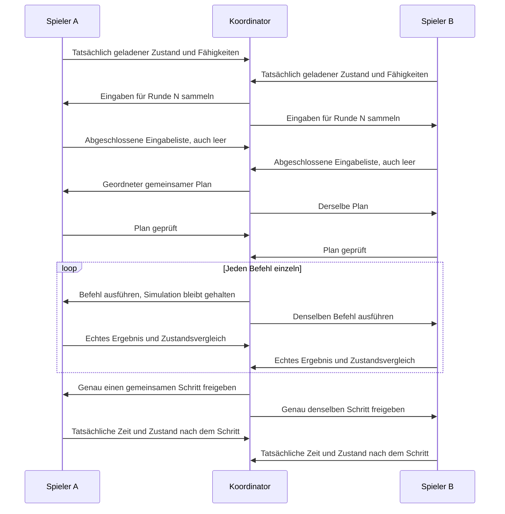

# TF2: Prototyp für strikte Synchronisation

Dieser Ordner enthält den Synchronisationskern und die Komponenten des
kontrollierten Engineversuchs. Der Launcher bereitet eine eigene Testinstallation
vor und kann die vorherigen Dateien anschließend wiederherstellen.

Der aktuelle **Alpha5.4-Diagnose-Launcher** bietet im ersten Reiter
**API-Diagnose allein** eine Erfassung auf einem einzelnen PC: lokale Pfade
prüfen, **Diagnose vorbereiten**, TF2 selbst über Steam starten und die angezeigte
`TF2-API-Diagnose-….sav` ausschließlich mit **TF2 API-Diagnose (Alpha5.4)** und
**Legacy Fahrzeuge** laden. Nach etwa zehn Sekunden den eigenen
**Diagnosebericht als ZIP …** exportieren. Verbindung, IP, Sitzungscode und
Mitspieler sind dafür nicht erforderlich. Ablauf und Wiederherstellung stehen
in [ANLEITUNG.md](ANLEITUNG.md), Zweck und Grenzen in
[API_DIAGNOSE.md](API_DIAGNOSE.md).

Die Diagnose liest vorhandene Kartenobjekte und getrennte API-Konstruktorproben.
Sie gibt keine Bau- oder Pausebefehle aus und startet keinen gemeinsamen
Messcontroller. Fehlende Liveobjekte sind fehlende Abdeckung, keine erfolgreichen
Prüfungen. Das öffentliche Paket enthält keine privaten Spielstände oder Berichte;
exportierte Diagnoseberichte ausschließlich privat zur Auswertung weitergeben.

Der bisherige gemeinsame Bautest bleibt im Reiter **Bautest (experimentell)**
mit Host/Beitreten, Sitzungscode, Verbindungsprüfung vor dem Spielstart,
reversibler Installation, Steam-Startknopf und Berichtsexport. Sein automatisches Profil
hat 240 Runden: Straße, Depot und Haltestellen werden automatisch gebaut, ein
Fahrzeug gekauft und einer Linie zugeordnet. Danach werden gemeinsame Fahrt,
Pause ab Runde 80 und Weiterlauf ab Runde 100 geprüft; der Mitspieler antwortet
absichtlich mit 100 ms Verzögerung. Ein Erfolg verlangt auch tatsächliche
Straßenverbindung, Kaufabbuchung und Fahrzeugbewegung. Ablauf und Grenzen stehen
in [BUILD_TEST.md](BUILD_TEST.md). Freies Bauen gehört weiterhin nicht zum Messmodus.

Die öffentliche Windows-Version steht in den
[GitHub-Releases von TastierPizza-code/TFCoop](https://github.com/TastierPizza-code/TFCoop/releases).
Der feste Downloadlink heißt
[TFCoop-Windows.zip](https://github.com/TastierPizza-code/TFCoop/releases/latest/download/TFCoop-Windows.zip).
Ab `v0.5.2` prüft der Launcher beim Start veröffentlichte Releases, lädt neuere
Pakete herunter und startet nach deren Prüfung die neue Version. Git und Python
sind auf den Spieler-PCs nicht erforderlich. Details zu Updateprüfung, lokalem
Spielstand und Veröffentlichung stehen in [GITHUB_UPDATES.md](docs/GITHUB_UPDATES.md).

**Entwicklungsprototyp, kein fertiges Koop-Update.** Modell, native Steuerung und
Lua-Dateianbindung sind gebaut und automatisiert geprüft. Ein echter Alpha4.2-
Nutzertest hat alle 100 gemeinsamen Runden mit übereinstimmenden begrenzten
Messwerten abgeschlossen: 80 Schritte à 0,2 Sekunden und 20 Pausenrunden.
Der Host bestätigt die Abschlusswerte beider Spielinstanzen. Der Alpha5-Bauablauf
ist mit Ersatzengines geprüft. Echte Nutzertests erreichten bisher Abbrüche bei
der Platzsuche beziehungsweise beim Lesen des Zustands nach dem Straßenbau.
Im Alpha5.2-Nutzertest wurde die Straße gebaut; anschließend brach das Lesen der
Konstruktionstransformation in Runde 1 ab. Alpha5.3 behob den dabei beobachteten
Fehler der Lua-Rückgabewerte. Im anschließenden echten Alpha5.3-Test erschien nach
dem Straßenbau `invalid finite build value`. Das betroffene Zahlenfeld ist noch
nicht bekannt. Alpha5.4 liefert dafür einen Solo-Diagnosemodus, keinen bestätigten
Fix und keinen Nachweis für den weiteren Bauablauf oder deterministischen Multiplayer.
Normale Bauwerkzeuge und eine aktive gemeinsame Wirtschaft sind damit noch
nicht umfassend geprüft oder vollständig an die neue Eingabesteuerung angeschlossen.

Der konkrete Prüfstand und die Grenzen der Ergebnisse stehen in
[VERIFICATION.md](VERIFICATION.md).

Alpha5.1 korrigiert die im echten Test gescheiterte Baustellensuche: größerer
Suchbereich, feinere Geländeprüfung und eine gemeinsam beim Straßenbau geebnete
Testfläche. Ablehnungsgründe und aktuelle Geländeproben werden aufgezeichnet.
Der automatische Ablauf bleibt bei 240 Runden; normale Bau-/Pausetasten und
gleichzeitige konkurrierende Bauwünsche sind noch nicht angeschlossen.

Alpha5.2 verarbeitet die von TF2 als `userdata` gelieferten
Konstruktionsparameter, die den Abbruch `nonplain observed params` auslösten.
Der Zustandsvergleich bleibt an die tatsächlich beobachteten Werte gebunden.
Der neue GitHub-Updateweg verändert weder das Testprofil noch dessen begrenzte
Aussagekraft: 240 Runden, vorbereitete Testbefehle, keine normalen Bauwerkzeuge,
keine Spielercursor und keine Weitergabe der normalen Pause-Taste.

Alpha5.3 korrigiert den daraufhin im echten Spiel aufgetretenen Lua-Fehler
`bad argument #1 to 'type' (value expected)`. Beim geschützten Zugriff auf ein
nicht verfügbares Transformationsfeld gab der Hilfsleser bisher null Rückgabewerte
zurück. Ein unmittelbarer Aufruf von `type(...)` erhielt dadurch kein Argument.
Der Fehlerpfad liefert jetzt ausdrücklich ein `nil`, sodass die vorhandene
Prüfung und der alternative Transformationsleser ausgeführt werden können.
Das Testprofil und die Kriterien für einen erfolgreichen Abschluss bleiben gleich.

Spieler mit einem Launcher ab Alpha5.2 erhalten Alpha5.4 über die vorhandene
Updatefunktion: TF2 und Messcontroller schließen, den Launcher normal öffnen
und auf **Alpha5.4-Diagnose** warten. Danach **Diagnose vorbereiten** im ersten
Reiter verwenden. Die Vorbereitung setzt die bisherige strikte
Testinstallation zurück und erstellt eine frische Save-Kopie für die Diagnosemod.
Ein erneuter ZIP-Download ist bei funktionierender Updateprüfung nicht nötig.
Zunächst den eigenen Diagnosebericht auswerten; der gemeinsame Bautest ist
jetzt nicht der nächste empfohlene Versuch.

Alpha4.1 korrigiert den beim ersten echten Zweirechnertest beobachteten Abbruch:
Der alte 0,1-Sekunden-Schritt verletzte die 0,2-Sekunden-Mindestgröße der Engine.
Das aktuelle Protokoll für die echte Engine verwendet 200000 Mikrosekunden und
Native ABI 3. Die Assertion der Originalengine wurde nicht verändert.

Alpha4.2 behandelt vorübergehende Windows-Dateisperren beim Statusaustausch
mit begrenzten Wiederholungen. Dauerhafte I/O-Fehler halten weiterhin an.
Der eigentliche Fehler wird an den Host übertragen; die Fortschrittsanzeige
behält beim Abbruch die zuletzt gemeldete Runde. Details stehen im Paket
in `IO_FIX.md`.

## Gemeinsame Ausführung



Keine Eingabe wirkt bereits beim Sammeln lokal. Die Reihenfolge ist von der
Ankunftsreihenfolge der Netzwerkpakete unabhängig. Ein fehlender Teilnehmer, ein
ungültiger Befehl, ein fehlgeschlagener Spielaufruf oder eine Abweichung beendet
die Freigaben dauerhaft. Es gibt kein automatisches Weiterlaufen nach Timeout
und keinen stillen Wiedereinstieg in eine anders fortgeschrittene Welt.

Bei Pause werden Befehle weiterhin in gemeinsamen Runden abgearbeitet; die
angeforderte Zeitschrittweite ist dann null. Protokollrunden sind deshalb nicht
mit verstrichener Spielzeit gleichzusetzen. Eine bereits an beide Seiten
freigegebene Aktion kann bei einem anschließenden Verbindungsabbruch noch fertig
werden; das Protokoll verspricht keinen verteilten Rollback bereits ausgeführter
Aktionen. Vor einer neuen Sitzung ist ein gemeinsamer Ausgangsstand erforderlich.

## Ausführbare Modellprüfung

Im Projektordner:

```powershell
.\prototype\build-native.cmd
py -3.10 -m unittest discover -s prototype/tests -v
py -3.10 prototype/mod/tf2_strict_probe_1/tests/test_literal_lua.py
py -3.10 -m prototype.strict_sync.smoke
```

Oder zusammen `prototype\test.cmd`. Für den nativen Teil werden MSVC 2022 x64
Build Tools benötigt. Die Tests starten ausschließlich eigene versteckte
Testprozesse. Sie bedienen kein Fenster, starten TF2 nicht und verändern keine
Spieldateien. Der Mehrprozesstest schreibt seine Berichte standardmäßig in ein
neues temporäres Verzeichnis und gibt den Pfad aus.

Die Lua-Tests benötigen Lupa mit Lua 5.1–5.4. In diesem Projekt liegt diese
Testabhängigkeit unter `tests/lua/.deps`; sie gehört nicht zur Spielmod.
Der Integrationslauf führt die unveränderten Lua-Quelldateien mit dem echten
Python-Dateiadapter aus. Nur die Spiel-API und die native Spielzeit sind dabei
Testersatz. Ein grüner Lauf ist deshalb kein Test in TF2.

Der Test startet einen Koordinator und zwei unabhängige Repliken über echtes
lokales TCP. Jede Replik besitzt eigene Objekte und unterschiedliche lokale
Entity-IDs. Die Sequenz enthält Straßen, Depots, zwei leere Linien, konkurrierende
Linienänderungen, Kauf, Zuweisung sowie Pause und Weiterlauf. Weitere Durchläufe
verzögern einen Teilnehmer, zerlegen Nachrichten, senden Duplikate oder erzeugen
gezielt Abbruch, fehlende Eingaben, unterschiedliche Ausgangszustände, Geld- und
Fahrzeugzuweisungsabweichungen.

Die verwendete Modellwelt hat ausdrücklich erfundene einfache Verkehrs- und
Kostenregeln. Sie prüft den Synchronisationsvertrag, nicht die Funktionsweise oder
Deterministik von Transport Fever 2. Der Hash enthält in diesem Modell die gesamte
definierte Welt; daraus folgt keine vollständige Hashabdeckung der realen Engine.

## Spielnahe Komponenten

- `native/step_probe.*` steuert die beiden Geschwindigkeitsabfragen innerhalb des
  originalen Simulationsschritts. Ein Permit erlaubt genau einen inneren Durchlauf
  mit 200000 Mikrosekunden; ohne Permit wird der pausierte Wartungspfad benutzt.
  Der Prototyp liest außerdem die tatsächliche Enginezeit vor und nach dem Aufruf
  und prüft die erwartete Differenz.
- `native/deferred_command.*` hält vollständige native Befehle samt ursprünglichen
  Abschlussfunktionen zurück. Es meldet erst den beobachteten Abschluss als
  Ergebnis. Die Verdrahtung mit den normalen UI-Aufrufen ist noch nicht fertig;
  unerfüllte Voraussetzungen werden nicht durch optimistische Ausführung ersetzt.
- Die getrennte Audio-Proxyvariante lädt ausschließlich den Messmodus, wenn ein
  lebender Prototyp-Controller eine kurz gültige Startdatei bereitgestellt hat.
  Sie lädt die bisherige Alpha-Bridge nicht zusätzlich.
- `strict_sync/engine_mailbox.py` fordert echte Lua-Snapshots und Ergebnisse an.
  Nach einem nativen Zeitschritt wartet es zusätzlich auf den Lua-Weltvergleich.
  `strict_sync/game_runner.py` verbindet diesen Adapter mit dem gemeinsamen
  TCP-Protokoll. Es startet und installiert das Spiel nicht.
- `mod/tf2_strict_probe_1` setzt ausschließlich vorbereitete Testbefehle über die
  Spiel-API um. Es liest tatsächliche Firmenwerte, Zeit und explizit gebundene
  Objekte. Neue Linien und Fahrzeuge benötigen echte Ergebnis-IDs. Das Profil
  `build_v1` nutzt eine eigene Straßenkonstruktion und lokal vorhandene
  Standardgebäude, Module und Fahrzeugmodelle. Der ältere allgemeine Adapter
  kann zusätzlich mit ausdrücklich angegebenen Objektvorlagen arbeiten.

Der Befehl `ROAD` wird im Engineversuch bereits bei der Vorbereitung verweigert:
Upstream hat für Straßen leere `BuildProposal.resultEntities` beobachtet.
Eine Straßen-ID anhand ähnlicher Geometrie zu raten wäre für den strikten Ablauf
unzureichend. Die Modellprüfung kann Straßen weiterhin als Modellbefehle prüfen.
Der Alpha5-Bautest verwendet deshalb den eigenen Befehl `PROBE_ROAD` mit einer
Straßenkonstruktion und liest deren tatsächlich erzeugte, gebundene Kanten aus.

Details stehen in `native/STEP_BOUNDARY.md` und
`native/DEFERRED_COMMAND_ADAPTER.md`.

## Vorbereiteter Messstand

`strict_sync/stage_probe.py` erstellt ausschließlich neue lokale Ausgabe- und
Sitzungsordner. Es prüft den exakten Spielbuild und die Original-Audiobibliothek,
kopiert beide Save-Dateien und bereitet die getrennte Messmod samt DLLs vor.
Gemeinsame Hashes binden Spielbuild, Quelldateien, Testsave und Objektvorlagen;
die Konfiguration enthält zusätzlich den lokalen Mailboxpfad und eine frische
Sitzungsnummer. Vorhandene Ausgabeordner werden nicht überschrieben.

Das ältere CLI-Profil `time_v1` dient einem ersten Versuch für Zeit, Pause und
Firmenwerte. `examples/time-a.json` und `examples/time-b.json` enthalten dafür
zehn gemeinsame Runden mit Pause und Weiterlauf. Bei Erfolg sind insgesamt acht
Schritte zu je 200000 Mikrosekunden vergangen. Die Zahlen sind Enginezeit;
Kalenderdatum und dessen eingestellte Fortschrittsrate sind davon zu unterscheiden.

Die frühere Vorbereitung unter `staged/time-probe-20260906` und
`sessions/time-probe-20260906` ist ein historischer Stand mit damaligen Codehashes.
Der Bautestabschnitt des Launchers bereitet auf jedem PC eine neue Sitzung aus den
aktuellen Programmdateien vor. Die öffentliche ZIP enthält **keinen Ausgangsspielstand**,
keine lokalen Sitzungsdateien und keine Originaldateien des Spiels. Ihr Manifest
enthält nur die SHA-256-Identität des benötigten privaten Save-Paars.
`baseline.py` prüft passende lokale Kopien und übernimmt sie aus dem letzten
vorbereiteten Testlauf, einem alten privaten Paket oder einer ausdrücklichen
Dateiauswahl. Die geprüfte Kopie bleibt in `%LOCALAPPDATA%\TF2StrictProbe\baseline`
über Programmupdates hinweg erhalten. Lokale Pfade und Sitzungsnummern werden
erst beim Nutzer erzeugt.

Ein echter Messlauf braucht einen frischen Spielprozess, den gemeinsamen
Ausgangssave und ausschließlich die dafür aktivierte Testmod. Die bisherigen
Koop-Spielskripte dürfen dabei keine Befehle einspeisen. Beide PCs müssen ihren
Messstand getrennt vorbereiten und dieselbe Netzwerk-Sitzung verwenden. Der
Controller erlaubt dafür TCP über LAN/Hamachi; Steam-Einladungen sind nicht
implementiert. Normale Bauwerkzeuge bleiben während dieses Versuchs unbenutzt.

Die Launcher-Lobby benutzt TCP 34208, der Messkoordinator TCP 34207. Eine gültige
Lobbybestätigung enthält die passende Sitzung und identische Dateihashes. Sie
bestätigt die Verbindung, nicht die tatsächlich geladene Welt. Erst danach werden
die Messcontroller bereitgestellt. Der Spielstartknopf ruft Steam ausschließlich
durch den Klick des Nutzers auf; Entwicklungs- und Pakettests führen ihn nicht aus.

Die Controller können nach einer Freigabe nie automatisch in normalen Spielbetrieb
zurückfallen. Ein Fehler oder Messende führt zum dauerhaften Halt bis Prozessende;
für einen weiteren Versuch braucht es eine neue Sitzung und den Ausgangssave.
Im Messmodus gespeicherte Fortsetzungen werden als neue Ausgangssitzung abgewiesen.
Die Sitzung wird außerdem vor ihrer ersten Startfreigabe dauerhaft als verwendet
markiert. Alte Statusdateien oder Befehle verhindern bereits diese Freigabe und
können dadurch nicht beim nächsten Spielstart erneut ausgeführt werden.

## Was der Versuch noch entscheiden muss

Der native HOLD-Pfad ist kein Beweis einer unveränderten Welt. Auch bei Pause
führt TF2 Wartungs-, Skript- und Befehlsarbeit aus und verändert interne Zähler.
Unterschiedlich viele Wartungsdurchläufe können daher relevant sein, obwohl
beide eigentlichen Simulationsuhren gleich stehen. Das wird als offene
Voraussetzung ausgewiesen und darf nicht durch ein grünes SYNC-Symbol verdeckt
werden.

Für das vollständige freie Bauen fehlen weiterhin die überprüfte Erfassung
aller normalen Eingaben vor ihrer Wirkung, vollständige Konstruktionsparameter,
die richtige Verarbeitung im erzeugenden Spielthread, echte Abschlussbeobachtung
und ein ausreichend vollständiger Zustandsvergleich. Steam-Einladungen, große
Karten und Wiederaufnahme nach Absturz werden durch diesen Prototyp noch nicht
zugesichert.

Zuerst soll der Solo-Diagnosebericht die tatsächlichen API-Zugriffe eingrenzen.
Ein späterer vollständiger Bauversuch muss zeigen, ob Zeit, explizit geprüfte
Bauobjekte, Firmenwerte und Fahrzeugbewegung trotz verschiedener Wartezeiten
gleich bleiben. Der abgeschlossene Zeit-/Pausetest beantwortet diese zusätzliche
Frage noch nicht. Auch ein bestandener Bautest ersetzt keine vollständige
Prüfung des freien gemeinsamen Spielbetriebs.
