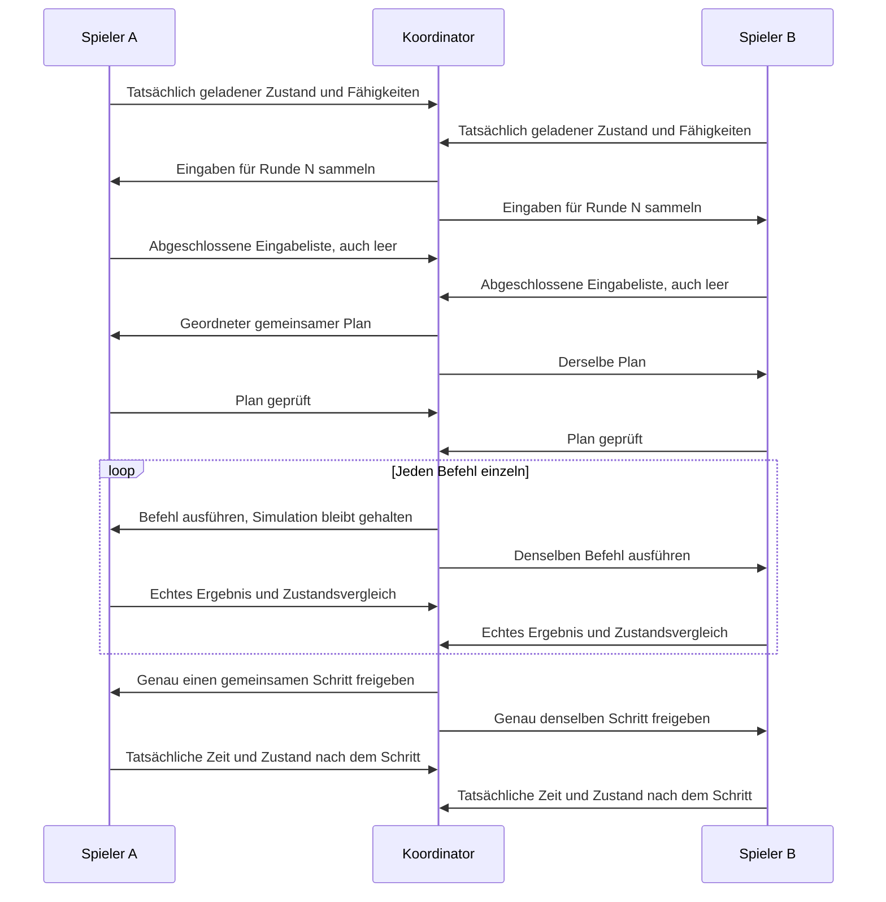

# TF2: Prototyp für strikte Synchronisation

**Alpha5.10-Bautest behebt einen mit Alpha5.9 eingeführten Startfehler.**
Die Rückgabewerte des Bauadapters werden jetzt ohne die von TF2 veränderte
`table.unpack`-Funktion weitergereicht. Der Lebensdauerschutz nativer Elternobjekte
und das automatische 240-Runden-Bauprofil bleiben erhalten. Die private Basis
ist dieselbe wie in Alpha5.9: die bisherige sehr große Karte mit bereits
ausgewählten Testmods. Ein bereits importiertes Paar muss nicht erneut
übernommen werden; eine weitere Solo-Diagnose ist nicht erforderlich.

Dieser Ordner enthält den Synchronisationskern und die Komponenten des
kontrollierten Engineversuchs. Der Launcher bereitet eine eigene Testinstallation
vor und kann die vorherigen Dateien anschließend wiederherstellen.

Der aktuelle **Alpha5.10-Bautest-Launcher** öffnet zuerst den Reiter
**Bautest (experimentell)**. Nach dem Update auf beiden PCs die vorherige
Installation, insbesondere die Diagnosemod, wiederherstellen. Über
**Testspielstand übernehmen …** die seit Alpha5.9 bereitgestellte
`Testspielstand/initial.sav` mit unveränderter `initial.sav.lua` daneben auswählen,
falls diese Basis noch nicht lokal vorhanden ist. Die Paketbasis vor Alpha5.9
hat andere Prüfsummen. Dann Rollen,
Host-IP und frischen gemeinsamen Sitzungscode festlegen, neu vorbereiten und
verbinden. Beide laden ihre neue Messtest-Save mit **TF2 Strict Sync - automatischer
Bautest (Alpha5.10)** und **Legacy Fahrzeuge**. Diese Modliste ist bereits in der
neuen Basis gespeichert und muss nicht jedes Mal umgestellt werden. Ablauf und Wiederherstellung stehen
in [ANLEITUNG.md](ANLEITUNG.md).

**API-Diagnose allein** bleibt im zweiten Reiter für gezielte Untersuchungen
verfügbar. Ihre Erfassung liest vorhandene Kartenobjekte und getrennte
API-Konstruktorproben, ohne Bau- oder Pausebefehle auszugeben. Fehlende Liveobjekte
sind fehlende Abdeckung, keine erfolgreichen Prüfungen. Zweck und Grenzen stehen
in [API_DIAGNOSE.md](API_DIAGNOSE.md). Private Spielstände und Berichte gehören
nicht in öffentliche Releases; Berichte ausschließlich privat weitergeben.

Der gemeinsame Bautest bietet
Host/Beitreten, Sitzungscode, Verbindungsprüfung vor dem Spielstart,
reversibler Installation, Steam-Startknopf und Berichtsexport. Sein automatisches Profil
hat 240 Runden: Straße, Depot und Haltestellen werden automatisch gebaut, ein
Fahrzeug gekauft und einer Linie zugeordnet. Danach werden gemeinsame Fahrt,
Pause ab Runde 80 und Weiterlauf ab Runde 100 geprüft; der Mitspieler antwortet
absichtlich mit 100 ms Verzögerung. Ein Erfolg verlangt auch tatsächliche
Straßenverbindung, Kaufabbuchung und Fahrzeugbewegung. Ablauf und Grenzen stehen
in [BUILD_TEST.md](BUILD_TEST.md). Freies Bauen gehört weiterhin nicht zum Messmodus.

Die öffentliche Windows-Version steht in den
[GitHub-Releases von TastierPizza-code/TFCoop](https://github.com/TastierPizza-code/TFCoop/releases).
Der feste Downloadlink heißt
[TFCoop-Windows.zip](https://github.com/TastierPizza-code/TFCoop/releases/latest/download/TFCoop-Windows.zip).
Ab `v0.5.2` prüft der Launcher beim Start veröffentlichte Releases, lädt neuere
Pakete herunter und startet nach deren Prüfung die neue Version. Git und Python
sind auf den Spieler-PCs nicht erforderlich. Details zu Updateprüfung, lokalem
Spielstand und Veröffentlichung stehen in [GITHUB_UPDATES.md](docs/GITHUB_UPDATES.md).

**Entwicklungsprototyp, kein fertiges Koop-Update.** Modell, native Steuerung und
Lua-Dateianbindung sind gebaut und automatisiert geprüft. Ein echter Alpha4.2-
Nutzertest hat alle 100 gemeinsamen Runden mit übereinstimmenden begrenzten
Messwerten abgeschlossen: 80 Schritte à 0,2 Sekunden und 20 Pausenrunden.
Der Host bestätigt die Abschlusswerte beider Spielinstanzen.

**Alpha5.10 hat einen echten lokalen Record und den vollständigen Replay in einem
zweiten, frisch gestarteten TF2-Prozess bestanden.** Der erste zeichnete zwölf
Befehle und 240 Schritte auf; der zweite verwendete diese Aufzeichnung vom selben
Ausgangsspielstand. Nach jeder Aktion stimmten Ergebnisse und gemessene Zustände
überein. Bestätigt wurden Straße, Depot, zwei Haltestellen, drei Verbindungen,
Fahrzeugkauf, Linienzuweisung, Abfahrt und Bewegung. Die 211 Fortschrittsschritte
ergaben 42,2 Sekunden Enginezeit. In den 29 Pausenschritten blieb die Spielzeit
stehen; während der zusammenhängenden Pause von Runde 80 bis 99 blieben auch
die beobachteten Zustände unverändert. Beide Prozesse wurden regulär beendet und die vorherige
Installation ohne Wiederherstellungsfehler zurückgesetzt. Diese nacheinander
ausgeführten Läufe auf einem PC sind kein Live-Netzwerktest und vergleichen nur
die erfassten Zustände, nicht sämtliche internen Daten der Spielwelt.

Zuvor hatte Alpha5.8 einen vollständigen Record und 99 passende Replayframes
erreicht, bevor das Lesen von `CONSTRUCTION.frozenEdges[1]` abbrach. Alpha5.9
ergänzte einen Lebensdauerschutz, führte dabei aber einen Startfehler ein.
Alpha5.10 korrigiert diesen Fehler; beide Abbrüche traten im neuen vollständigen
Aufnahme- und Wiederholungslauf nicht mehr auf.
Im früheren Alpha5.7-Zweirechnerversuch waren Straße, Depot und zwei
Haltestellen mit übereinstimmenden Journalzuständen gebaut worden; damals stoppte
der Anschlussleser vor dem Verbindungsbau.
Im Alpha5.2-Nutzertest wurde die Straße gebaut; anschließend brach das Lesen der
Konstruktionstransformation in Runde 1 ab. Alpha5.3 behob den dabei beobachteten
Fehler der Lua-Rückgabewerte. Im anschließenden echten Alpha5.3-Test erschien nach
dem Straßenbau `invalid finite build value`. Die geborgenen Alpha5.4-Berichte zeigen
fehlendes `timeBuild` an zwei bestehenden Industriekonstruktionen. Dasselbe Feld
fehlt laut den neuen Alpha5.6-Rohdaten auch an der erfolgreich gebauten
Teststraße. Seine Abwesenheit wird seit Alpha5.6 ausdrücklich abgebildet.
Normale Bauwerkzeuge und eine aktive gemeinsame Wirtschaft sind damit noch
nicht umfassend geprüft oder vollständig an die neue Eingabesteuerung angeschlossen.

Der konkrete Prüfstand und die Grenzen der Ergebnisse stehen in
[VERIFICATION.md](VERIFICATION.md).

Seit Alpha5.9 hält der Bauadapter gelesene Komponenten und Zwischencontainer während
einer vollständigen `bind_initial`-, `plan`-, `finish`- oder `snapshot`-Operation
stark referenziert. Erst nachdem ihre Beobachtungen in normale Lua-Werte übertragen
wurden, werden diese Referenzen freigegeben; auch Fehlerpfade räumen sie auf.
Die Anzahl verschiedener Elternobjekte ist begrenzt. Das schließt eine gefundene
Lücke beim Lesen mehrstufiger geliehener API-Werte, ohne Getter zu wiederholen,
Listen umzudeuten oder Digestregeln zu ändern. Dass genau eine Lua-GC-Freigabe
den früheren echten Replayabbruch ausgelöst hat, bleibt eine Hypothese.
Der vollständige Alpha5.10-Record und sein Replay gelangen mit diesem Schutz.

Alpha5.10 korrigiert die Rückgabe dieses Operationsschutzes. TF2 überschreibt
`table.unpack` und ignoriert dabei die optionalen Bereichsgrenzen. Der bisherige
Aufruf zum Entfernen des `pcall`-Erfolgswerts lieferte deshalb stattdessen `true`
als erstes Ergebnis. Der Adapter gibt die Lua-Varargs jetzt direkt weiter und
räumt die gehaltenen Referenzen weiterhin bei Erfolg und Fehler auf.

Alpha5.1 korrigiert die im echten Test gescheiterte Baustellensuche: größerer
Suchbereich, feinere Geländeprüfung und eine gemeinsam beim Straßenbau geebnete
Testfläche. Ablehnungsgründe und aktuelle Geländeproben werden aufgezeichnet.
Der automatische Ablauf bleibt bei 240 Runden; normale Bau-/Pausetasten und
gleichzeitige konkurrierende Bauwünsche sind noch nicht angeschlossen.

Alpha5.2 verarbeitet die von TF2 als `userdata` gelieferten
Konstruktionsparameter, die den Abbruch `nonplain observed params` auslösten.
Der Zustandsvergleich bleibt an die tatsächlich beobachteten Werte gebunden.
Der neue GitHub-Updateweg verändert weder das Testprofil noch dessen begrenzte
Aussagekraft: 240 Runden, vorbereitete Testbefehle, keine normalen Bauwerkzeuge,
keine Spielercursor und keine Weitergabe der normalen Pause-Taste.

Alpha5.3 korrigiert den daraufhin im echten Spiel aufgetretenen Lua-Fehler
`bad argument #1 to 'type' (value expected)`. Beim geschützten Zugriff auf ein
nicht verfügbares Transformationsfeld gab der Hilfsleser bisher null Rückgabewerte
zurück. Ein unmittelbarer Aufruf von `type(...)` erhielt dadurch kein Argument.
Der Fehlerpfad liefert jetzt ausdrücklich ein `nil`, sodass die vorhandene
Prüfung und der alternative Transformationsleser ausgeführt werden können.
Das Testprofil und die Kriterien für einen erfolgreichen Abschluss bleiben gleich.

Seit Alpha5.6 wird ein tatsächlich fehlendes `CONSTRUCTION.timeBuild` als
`{available=false}` im gehashten Zustand gespeichert. Vorhandene Werte bleiben gemessen;
ein fehlender Wert wird nicht durch eine erfundene Null ersetzt. `stopIndex`
darf vor der Linienzuordnung fehlen und ist nach einer Zuordnung verpflichtend.
`loadConfig` akzeptiert den dokumentierten Wert `-1` für automatische Auswahl.
Numerische Lesefehler enthalten den jeweiligen Feldpfad.

Bei einem strikten Bauabbruch liest ein unabhängiger, auf 98304 Bytes begrenzter
Collector die aktuellen gebundenen Objekte. Die separate Datei `lua_api_audit.json`
kommt in den normalen Testbericht. `lua_status.json` enthält Dateihinweis,
Schreib-/Rücklesestatus, begrenzte Fehlversuchsmetadaten und seit Alpha5.7
getrennt markierte tatsächliche Callback-Daten. Diese Rohdiagnose
trägt `valid_snapshot=false`; ihre Fließkommazahlen bleiben außerhalb des
strikten Synchronitätsprotokolls. Der letzte gültige Snapshot bleibt separat
als historisch markiert. Der Strict-Mod bringt eine eigene byteidentische
Collector-Kopie mit, sodass der Solo-Mod deaktiviert bleiben kann.

Spieler mit einem Launcher ab Alpha5.2 erhalten Alpha5.10 über die vorhandene
Updatefunktion: TF2 und Messcontroller schließen, den Launcher normal öffnen
und auf **Alpha5.10-Bautest** warten. Danach vorherige Installation wiederherstellen,
die saubere Basis aus Alpha5.9 bei Bedarf einmal übernehmen und im ersten Reiter mit frischem
gemeinsamem Code neu vorbereiten. Ein erneuter Download der Programm-ZIP ist bei
funktionierender Updateprüfung nicht nötig. Nach diesem
Versuch werden beide normalen Testbericht-ZIPs benötigt.

Alpha4.1 korrigiert den beim ersten echten Zweirechnertest beobachteten Abbruch:
Der alte 0,1-Sekunden-Schritt verletzte die 0,2-Sekunden-Mindestgröße der Engine.
Das aktuelle Protokoll für die echte Engine verwendet 200000 Mikrosekunden und
Native ABI 3. Die Assertion der Originalengine wurde nicht verändert.

Alpha4.2 behandelt vorübergehende Windows-Dateisperren beim Statusaustausch
mit begrenzten Wiederholungen. Dauerhafte I/O-Fehler halten weiterhin an.
Der eigentliche Fehler wird an den Host übertragen; die Fortschrittsanzeige
behält beim Abbruch die zuletzt gemeldete Runde. Details stehen im Paket
in `IO_FIX.md`.

## Gemeinsame Ausführung



Keine Eingabe wirkt bereits beim Sammeln lokal. Die Reihenfolge ist von der
Ankunftsreihenfolge der Netzwerkpakete unabhängig. Ein fehlender Teilnehmer, ein
ungültiger Befehl, ein fehlgeschlagener Spielaufruf oder eine Abweichung beendet
die Freigaben dauerhaft. Es gibt kein automatisches Weiterlaufen nach Timeout
und keinen stillen Wiedereinstieg in eine anders fortgeschrittene Welt.

Bei Pause werden Befehle weiterhin in gemeinsamen Runden abgearbeitet; die
angeforderte Zeitschrittweite ist dann null. Protokollrunden sind deshalb nicht
mit verstrichener Spielzeit gleichzusetzen. Eine bereits an beide Seiten
freigegebene Aktion kann bei einem anschließenden Verbindungsabbruch noch fertig
werden; das Protokoll verspricht keinen verteilten Rollback bereits ausgeführter
Aktionen. Vor einer neuen Sitzung ist ein gemeinsamer Ausgangsstand erforderlich.

## Ausführbare Modellprüfung

Im Projektordner:

```powershell
.\prototype\build-native.cmd
py -3.10 -m unittest discover -s prototype/tests -v
py -3.10 prototype/mod/tf2_strict_probe_1/tests/test_literal_lua.py
py -3.10 -m prototype.strict_sync.smoke
```

Oder zusammen `prototype\test.cmd`. Für den nativen Teil werden MSVC 2022 x64
Build Tools benötigt. Die Tests starten ausschließlich eigene versteckte
Testprozesse. Sie bedienen kein Fenster, starten TF2 nicht und verändern keine
Spieldateien. Der Mehrprozesstest schreibt seine Berichte standardmäßig in ein
neues temporäres Verzeichnis und gibt den Pfad aus.

Die Lua-Tests benötigen Lupa mit Lua 5.1–5.4. In diesem Projekt liegt diese
Testabhängigkeit unter `tests/lua/.deps`; sie gehört nicht zur Spielmod.
Der Integrationslauf führt die unveränderten Lua-Quelldateien mit dem echten
Python-Dateiadapter aus. Nur die Spiel-API und die native Spielzeit sind dabei
Testersatz. Ein grüner Lauf ist deshalb kein Test in TF2.

Der Test startet einen Koordinator und zwei unabhängige Repliken über echtes
lokales TCP. Jede Replik besitzt eigene Objekte und unterschiedliche lokale
Entity-IDs. Die Sequenz enthält Straßen, Depots, zwei leere Linien, konkurrierende
Linienänderungen, Kauf, Zuweisung sowie Pause und Weiterlauf. Weitere Durchläufe
verzögern einen Teilnehmer, zerlegen Nachrichten, senden Duplikate oder erzeugen
gezielt Abbruch, fehlende Eingaben, unterschiedliche Ausgangszustände, Geld- und
Fahrzeugzuweisungsabweichungen.

Die verwendete Modellwelt hat ausdrücklich erfundene einfache Verkehrs- und
Kostenregeln. Sie prüft den Synchronisationsvertrag, nicht die Funktionsweise oder
Deterministik von Transport Fever 2. Der Hash enthält in diesem Modell die gesamte
definierte Welt; daraus folgt keine vollständige Hashabdeckung der realen Engine.

## Spielnahe Komponenten

- `native/step_probe.*` steuert die beiden Geschwindigkeitsabfragen innerhalb des
  originalen Simulationsschritts. Ein Permit erlaubt genau einen inneren Durchlauf
  mit 200000 Mikrosekunden; ohne Permit wird der pausierte Wartungspfad benutzt.
  Der Prototyp liest außerdem die tatsächliche Enginezeit vor und nach dem Aufruf
  und prüft die erwartete Differenz.
- `native/deferred_command.*` hält vollständige native Befehle samt ursprünglichen
  Abschlussfunktionen zurück. Es meldet erst den beobachteten Abschluss als
  Ergebnis. Die Verdrahtung mit den normalen UI-Aufrufen ist noch nicht fertig;
  unerfüllte Voraussetzungen werden nicht durch optimistische Ausführung ersetzt.
- Die getrennte Audio-Proxyvariante lädt ausschließlich den Messmodus, wenn ein
  lebender Prototyp-Controller eine kurz gültige Startdatei bereitgestellt hat.
  Sie lädt die bisherige Alpha-Bridge nicht zusätzlich.
- `strict_sync/engine_mailbox.py` fordert echte Lua-Snapshots und Ergebnisse an.
  Nach einem nativen Zeitschritt wartet es zusätzlich auf den Lua-Weltvergleich.
  `strict_sync/game_runner.py` verbindet diesen Adapter mit dem gemeinsamen
  TCP-Protokoll. Es startet und installiert das Spiel nicht.
- `mod/tf2_strict_probe_1` setzt ausschließlich vorbereitete Testbefehle über die
  Spiel-API um. Es liest tatsächliche Firmenwerte, Zeit und explizit gebundene
  Objekte. Neue Linien und Fahrzeuge benötigen echte Ergebnis-IDs. Das Profil
  `build_v2` nutzt eine eigene Straßenkonstruktion und lokal vorhandene
  Standardgebäude, Module und Fahrzeugmodelle. Der ältere allgemeine Adapter
  kann zusätzlich mit ausdrücklich angegebenen Objektvorlagen arbeiten.

Der Befehl `ROAD` wird im Engineversuch bereits bei der Vorbereitung verweigert:
Upstream hat für Straßen leere `BuildProposal.resultEntities` beobachtet.
Eine Straßen-ID anhand ähnlicher Geometrie zu raten wäre für den strikten Ablauf
unzureichend. Die Modellprüfung kann Straßen weiterhin als Modellbefehle prüfen.
Der Alpha5-Bautest verwendet deshalb den eigenen Befehl `PROBE_ROAD` mit einer
Straßenkonstruktion und liest deren tatsächlich erzeugte, gebundene Kanten aus.

Details stehen in `native/STEP_BOUNDARY.md` und
`native/DEFERRED_COMMAND_ADAPTER.md`.

## Vorbereiteter Messstand

`strict_sync/stage_probe.py` erstellt ausschließlich neue lokale Ausgabe- und
Sitzungsordner. Es prüft den exakten Spielbuild und die Original-Audiobibliothek,
kopiert beide Save-Dateien und bereitet die getrennte Messmod samt DLLs vor.
Gemeinsame Hashes binden Spielbuild, Quelldateien, Testsave und Objektvorlagen;
die Konfiguration enthält zusätzlich den lokalen Mailboxpfad und eine frische
Sitzungsnummer. Vorhandene Ausgabeordner werden nicht überschrieben.

Das ältere CLI-Profil `time_v1` dient einem ersten Versuch für Zeit, Pause und
Firmenwerte. `examples/time-a.json` und `examples/time-b.json` enthalten dafür
zehn gemeinsame Runden mit Pause und Weiterlauf. Bei Erfolg sind insgesamt acht
Schritte zu je 200000 Mikrosekunden vergangen. Die Zahlen sind Enginezeit;
Kalenderdatum und dessen eingestellte Fortschrittsrate sind davon zu unterscheiden.

Die frühere Vorbereitung unter `staged/time-probe-20260906` und
`sessions/time-probe-20260906` ist ein historischer Stand mit damaligen Codehashes.
Der Bautestabschnitt des Launchers bereitet auf jedem PC eine neue Sitzung aus den
aktuellen Programmdateien vor. Die öffentliche ZIP enthält **keinen Ausgangsspielstand**,
keine lokalen Sitzungsdateien und keine Originaldateien des Spiels. Ihr Manifest
enthält nur die SHA-256-Identität des benötigten privaten Save-Paars.
`baseline.py` prüft passende lokale Kopien und übernimmt ausschließlich das Paar
mit den erwarteten Prüfsummen. Seit Alpha5.9 wird die saubere Basis unter
`staged/local-clean-20260907/save/initial.sav` verwendet; öffentliche Pakete enthalten davon
nur die Hashes und Größen. Beide Spieler wählen einmal das separat bereitgestellte
`Testspielstand/initial.sav` mit passender `.sav.lua`. Alte Paketbasen und deren
Cacheeinträge werden bei abweichender Identität nicht akzeptiert oder gelöscht.
Die geprüfte neue Kopie bleibt in `%LOCALAPPDATA%\TF2StrictProbe\baseline`
über Programmupdates mit derselben Basis hinweg erhalten, auch bei Alpha5.10. Die private Weitergabe
umfasst beide unveränderten Dateien. Lokale Pfade und Sitzungsnummern werden erst
beim Nutzer erzeugt.

Ein echter Messlauf braucht einen frischen Spielprozess, den gemeinsamen
Ausgangssave und ausschließlich die dafür aktivierte Testmod. Die bisherigen
Koop-Spielskripte dürfen dabei keine Befehle einspeisen. Beide PCs müssen ihren
Messstand getrennt vorbereiten und dieselbe Netzwerk-Sitzung verwenden. Der
Controller erlaubt dafür TCP über LAN/Hamachi; Steam-Einladungen sind nicht
implementiert. Normale Bauwerkzeuge bleiben während dieses Versuchs unbenutzt.

Die Launcher-Lobby benutzt TCP 34208, der Messkoordinator TCP 34207. Eine gültige
Lobbybestätigung enthält die passende Sitzung und identische Dateihashes. Sie
bestätigt die Verbindung, nicht die tatsächlich geladene Welt. Erst danach werden
die Messcontroller bereitgestellt. Der Spielstartknopf ruft Steam ausschließlich
durch den Klick des Nutzers auf; Entwicklungs- und Pakettests führen ihn nicht aus.

Die Controller können nach einer Freigabe nie automatisch in normalen Spielbetrieb
zurückfallen. Ein Fehler oder Messende führt zum dauerhaften Halt bis Prozessende;
für einen weiteren Versuch braucht es eine neue Sitzung und den Ausgangssave.
Im Messmodus gespeicherte Fortsetzungen werden als neue Ausgangssitzung abgewiesen.
Die Sitzung wird außerdem vor ihrer ersten Startfreigabe dauerhaft als verwendet
markiert. Alte Statusdateien oder Befehle verhindern bereits diese Freigabe und
können dadurch nicht beim nächsten Spielstart erneut ausgeführt werden.

## Was der Versuch noch entscheiden muss

Der native HOLD-Pfad ist kein Beweis einer unveränderten Welt. Auch bei Pause
führt TF2 Wartungs-, Skript- und Befehlsarbeit aus und verändert interne Zähler.
Unterschiedlich viele Wartungsdurchläufe können daher relevant sein, obwohl
beide eigentlichen Simulationsuhren gleich stehen. Das wird als offene
Voraussetzung ausgewiesen und darf nicht durch ein grünes SYNC-Symbol verdeckt
werden.

Für das vollständige freie Bauen fehlen weiterhin die überprüfte Erfassung
aller normalen Eingaben vor ihrer Wirkung, vollständige Konstruktionsparameter,
die richtige Verarbeitung im erzeugenden Spielthread, echte Abschlussbeobachtung
und ein ausreichend vollständiger Zustandsvergleich. Steam-Einladungen, beliebige
Karten und Wiederaufnahme nach Absturz werden durch diesen Prototyp noch nicht
zugesichert.

Der echte Alpha5.10-Record und sein vollständiger Replay mit zwölf Befehlen und
240 Schritten sind ausgewertet; die Ergebnisse stimmen für die beobachteten Werte
nach jeder Aktion überein. Es bleibt zu prüfen, ob Zeit, Bauobjekte, Firmenwerte
und Fahrzeugbewegung beim gemeinsamen Netzwerktest trotz verschiedener Wartezeiten
gleich bleiben. Auch ein bestandener Bautest ersetzt keine vollständige Prüfung
des freien gemeinsamen Spielbetriebs.
